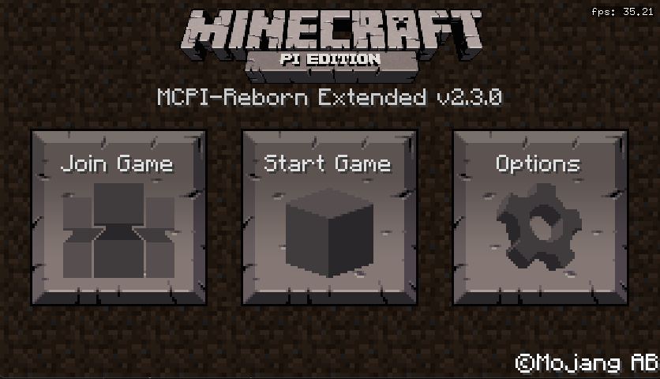

# MCPI++ (mcpi-reborn-extended)
This is a fork of [mcpi-reborn](https://gitea.thebrokenrail.com/TheBrokenRail/minecraft-pi-reborn) by MCPI Revival, with custom features added by community members. The apt packages and repo info are stored in the [debs](debs/) folder. The project is UNOFFICIAL from mcpi-reborn. If you like MCPI or MCPI-Reborn, you'll probably like this too!



Source code and documentation is in the [source](https://github.com/mobilegmYT/mcpi-reborn-extended/tree/source) branch.

## Installation ([compatibility list](https://github.com/mobilegmYT/mcpi-reborn-extended#compatibility))
```bash
wget -qO- https://raw.githubusercontent.com/mobilegmYT/mcpi-reborn-extended/main/install.sh | bash
```

### Uninstall
```bash
wget -qO- https://raw.githubusercontent.com/mobilegmYT/mcpi-reborn-extended/main/uninstall.sh | bash
```

## Feature List (in order of awesomeness)
- Supports all distros with glibc (everything in this [list](https://gist.github.com/wagenet/35adca1a032cec2999d47b6c40aa45b1) and everything based on them)
- Sound support
- Fix missing items in creative inventory
- Sprinting via `CTRL` key
- 1.18 textures
- Custom skins
- Add item names for some hidden items (like the camera)
- Sneaking via both the `Shift` and `Alt` keys
- A custom "[Cursed Chest](https://media.discordapp.net/attachments/761048906242981948/903080546182242344/2021-10-27_20.39.05.png)" block 
- Ability to look around via arrow keys instead of mouse (useful if mouse is glitched)
- [Colored](https://upww.screenrec.com/images/f_PX5iWMcfs6KLjEyqvmtU10Ozwogl4r3C.png) terminal output
- Use basic Vim keybindings for movement (hjkl)

## Compatibility
MCPI++ has been tested with the following:
- Raspberry Pi 3/4 running RPI OS Buster/Bullseye
- Windows 10/11 via WSL2 and GWSL (instructions [here](https://www.youtube.com/watch?v=3l-m8O13LYk))
- x64 PC running Debian/Ubuntu
- - MCPI++ should also support i386, but it is not tested

## Troubleshooting
- My mouse sensetivity is really high
- - If on WSL --> Follow this [tutorial](https://www.youtube.com/watch?v=3l-m8O13LYk)
- - If on bare metal Linux --> Uncheck `Disable Raw Mouse Motion` launch flag

## Credits
- Maintained by [mobilegmYT](https://github.com/mobilegmYT).
- Patches/mods by [bigjango13](https://github.com/bigjango13) and [TheBrokenRail](https://github.com/TheBrokenRail).
