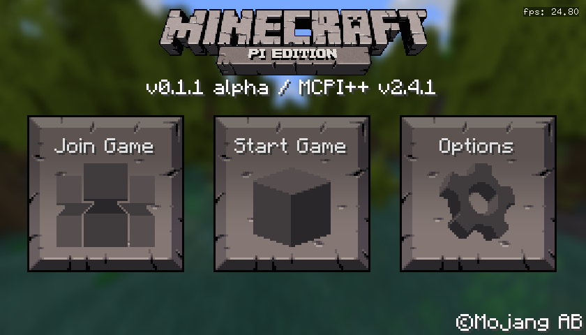

# MCPI++ (mcpi-reborn-extended)
This is a fork of [MCPI-Reborn](https://gitea.thebrokenrail.com/TheBrokenRail/minecraft-pi-reborn), with custom features added by community members. The APT packages and repo info are stored in the [debs](debs/) folder. The project is UNOFFICIAL from MCPI-Reborn. If you like MCPI or MCPI-Reborn, you'll probably like this too!

[](https://discord.gg/XJJNG9jTuh)



Source code and documentation is in the [source](https://github.com/NoozSBC/mcpi-reborn-extended/tree/source) branch.

## Installation ([compatibility list](https://github.com/NoozSBC/mcpi-reborn-extended#compatibility))

### Method 1 - Install Script
This method only supports Debian-based distros with APT. This method will also add sound support.
```bash
wget https://raw.githubusercontent.com/NoozSBC/mcpi-reborn-extended/main/install.sh && bash install.sh
```

#### Uninstall (if you used the script)
```bash
wget https://raw.githubusercontent.com/NoozSBC/mcpi-reborn-extended/main/uninstall.sh && bash uninstall.sh
```

### Method 2 - DEB Install
This script only supports Debian-based distros with APT. This method will also add sound support.
Download and install the appropiate DEB for your architecture with the `client` tag from [here](https://github.com/mobilegmYT/mcpi-reborn-extended/tree/main/debs)

### Method 3 - AppImage
Download and run the appropiate AppImage for your architecture with the `client` tag from [here](https://github.com/mobilegmYT/mcpi-reborn-extended/releases/). This is the only method that works on non-Debian distros like Arch or Fedora.

## Feature List (in order of awesomeness)
- Supports all distros with glibc (most major distros except musl-based ones like Alpine)
- Working sound
- Add missing items to creative inventory
- Sprinting via `Ctrl` key
- Modern textures
- Custom skins
- Longer chat message length limit (512 characters)
- Longer username length limit (32 characters)
- Add item names for some hidden items (like the camera)
- Sneaking via both the `Shift` and `Alt` keys
- A custom "[Cursed Chest](https://media.discordapp.net/attachments/761048906242981948/903080546182242344/2021-10-27_20.39.05.png)" block for debugging
- Ability to look around via arrow keys instead of mouse (useful if mouse is glitched)
- [Colored](https://upww.screenrec.com/images/f_PX5iWMcfs6KLjEyqvmtU10Ozwogl4r3C.png) terminal output
- Use basic Vim keybindings for movement (hjkl)

## Compatibility
MCPI++ has been tested with the following:
- Raspberry Pi 3/4 running Raspberry Pi OS Buster/Bullseye
- Windows 10/11 via WSL2 and GWSL (instructions [here](https://www.youtube.com/watch?v=3l-m8O13LYk))
- x64 PC running Debian/Ubuntu
- Chromebooks via Crostini (official support is not provided and performance may vary)

## User Guide
### Starting the game
Launch with `minecraft-pi-reborn-client` and configure your settings.

### Controls
Once you are in a world, you will be able to move with WASD/HJKL and Space.
You can look around with the mouse or arrow keys.
To look in your inventory use the "E" and to scroll use the mouse to drag.
To pause the game press Esc.
To sneak press Shift or Alt.
To sprint hold Ctrl and move.

### Entering A Game
Press "Start Game", then click "Create new" to make a new world. Once you load in, you can play around and do whatever. Pause the game with ESC and you can mute sounds or return to the main menu. To enter that world again, click "Start Game" and click on the picture for that world.

### Joining A Server
Open `~/.minecraft.pi/servers.txt` and add your servers, one address per line like this:
```
pbptanarchy.tk
pi-land.minecraft.pe:19132 <-- you can also specify port numbers!
```
Press "Join Game", and you will be greeted with a list of available servers. Click on one and it will connect. Playing on servers is the exact same as playing on multiplayer, except pausing won't pause the game for other people online and of course, there will be other players online who will all have the same skin as you.

### Installing Extra Mods.
MCPI mods are compiled into shared objects (also called "so files") to add them move them to `~/.minecraft-pi/mods/lib<modname>.so`.
If you are interested in making your own mods, documentation can be found [here](https://github.com/mobilegmYT/mcpi-reborn-extended/blob/source/docs/MODDING.md).

## Troubleshooting
- My mouse sensetivity is really high
- - If on WSL --> Follow this [tutorial](https://www.youtube.com/watch?v=3l-m8O13LYk)
- - If on bare metal Linux --> Uncheck `Disable Raw Mouse Motion` launch flag

## Credits
- Maintained by [Nooz](https://github.com/NoozSBC).
- Patches/mods by [Bigjango13](https://github.com/bigjango13) and [TheBrokenRail](https://github.com/TheBrokenRail).
- Vanilla Reborn by [TheBrokenRail](https://gitea.thebrokenrail.com/TheBrokenRail/minecraft-pi-reborn).
- Minecraft: Pi Edition by Mojang AB.
